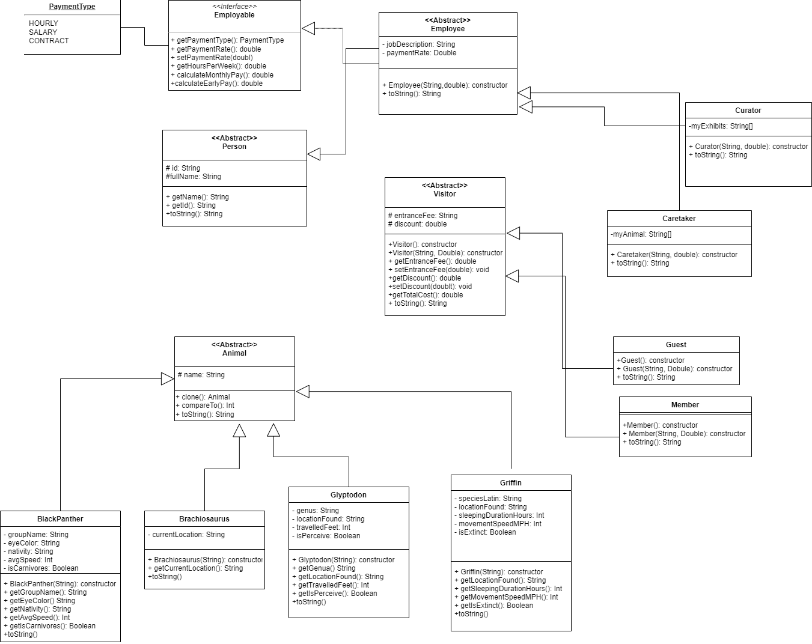

## ZooApp Project Description
This project is a demonstration of the skills we've learned in OOP. We are building a zoo full of animals users should be able to view the details of the animals at the zoo in a concise manner. in the future, Employees will be able to see their job description, how much they are paid, how often they work, and the animals or exhibits they are in charge of.

## Project Contributors:
 - Dana Ben Gigi
 - Ori Rinat
 - Nikole Waintraub
 - Noam Gil Or Yizraeli

## Additional Details
Noteable Project Functionalities:
 - ZooIndexController uses a callAnimalRun() function to dynamically call each Animal subclass's run(). This means we can add more animals at will to our getAnimalList() and it wont need to be updated. As long as the name in the list matches the animal's java file name we're safe
 - ZooIndexController uses provides an interface to the data retrieval and manipulation of the application
 - each animal type gets its animal picture by the contract data being transfered between the front and server side with most computational and manipulation processes being handled by the spring java server

---

For the initial project design reference view the UML displayed below

